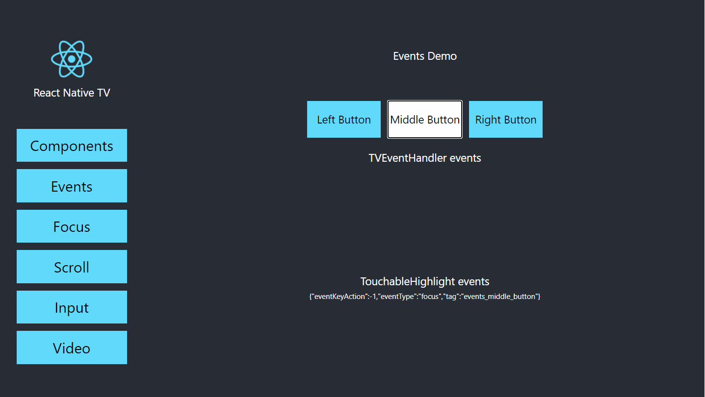
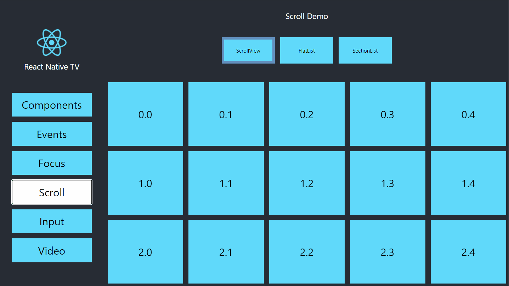

# react-native-tv-demo

Sample React Native project to test basic features on TV devices.

React Native has a documentation for building for TV Devices :<br />
https://reactnative.dev/docs/building-for-apple-tv<br />
    
This sample project provides UI elements to test compatibility accross targeted native devices and web.

Once the app is installed on the device, is is possible to test the following elements:
 - Events
 - Focus
 - Scroll
 - Input
 - Video 
 
## Get started

Install :

```
git clone git@github.com:dev-seb/react-native-tv-demo.git
cd react-native-tv-demo/
npm install
```

Test :

```
# AndroidTV
npm run android

# tvOS
npm run ios

# Browser
npm run web
```
 
## Demos

### Events



- TVEventHandler global events 
- Touchable events : onPress, onFocus, and onBlur.

### Focus


- hasTVPreferredFocus
- disabled
- nextFocusDown
- nextFocusUp
- nextFocusLeft
- nextFocusRight
- change style on select
- change style on press
- tvParallaxProperties

### Scroll



- vertical scroll
- horizontal scroll
- align vertically selected item
- center horizontally selected item

### Input


- selectable input
- autocompletion search
- nested selectable elements

### Video


- play / pause
- duration
- fullscreen
- overlay with timer

## Web support

React Native allows us to compile for AndroidTV and tvOS, that's great!<br />
But some Set-Top-Box or TV devices requires HTML5, or hybrid WebApps.<br />

To have a more universal app with the same code base, we can export a React Native project to web by following this steps :

### Add react-native-web with TV support:

React Native Web project doesn't support most features for TV, we have to use this fork instead:<br />
https://github.com/dev-seb/react-native-web

Install and build from sources :

```
git clone git@github.com:dev-seb/react-native-web.git
cd react-native-web/
git checkout feature/tv-support
npm install
npm run compile
```

Return to project root directory and add dependency locally :

```
npm install ./react-native-web/packages/react-native-web/
```

This fork requires the following env to be set in .env file :

```
REACT_APP_IS_TV=true
```

This will add support for Platform.isTV property.

### Add react-dom and react-scripts :

To bundle our code for web, we need react-dom and react-scripts : 

```
npm install react-dom
npm install react-scripts --save-dev
```

### Move web assets to "web" platform directory

Create a "web" directory at the root of the project to fit react-native distinct working directories per platform pattern.<br />
Inside this new directory, create "public" and "build" sub-directories, index.js and index.html files, following this tree structure :

```
web/
├── build/
├── public/
│   └── index.html
├── index.js
```

The web/index.js for web application is almost the same as for native apps, but it requires this code :

```javascript
AppRegistry.runApplication("MyTVApp", {
  rootTag: document.getElementById('main'),
});
```

### Add spatialNavigationPolyfill dependencies

AndroidTV and tvOS have build-in spatial navigation managment.

On web we can rely on the spatialNavigationPolyfill library to get a similar bahaviour:<br />
https://github.com/WICG/spatial-navigation/polyfill

Download the dependency at the root of the web directory and include it from the web/index.js file :

```
import './spatialNavigationPolyfill.js';
``` 

### Override react-scripts config

Install react-app-rewrired in order to override react-scripts configuration :

```
npm install react-app-rewired --save-dev
```

Add a "config-overrides.js" file at the root of the project :

```javascript
/**
 * react-app-rewirred overrides for react-scripts
 */
module.exports = {

  /**
   * Search for .web.js files
   */
  webpack: (config, env) => {
    config.resolve = {
      alias: {
        'react-native$': 'react-native-web',
      },
      extensions: [
        '.web.js',
        '.js',
      ],
    };
    return config;
  },

  /**
   * Changes paths to web/
   */
  paths: (paths, env) => {
    paths.appBuild = paths.appPath + '/web/build';
    paths.appPublic = paths.appPath + '/web/public';
    paths.appHtml = paths.appPath + '/web/public/index.html';
    paths.appIndexJs = paths.appPath + '/web/index.js';
    return paths;
  }

};
```

This will search for .web.js extension to include specific js files for web<br />
It also moves some files expected by react-scripts to the "web" directory.

### Change package.json file

Add alias in package.json file required by react-native-web :

```
"alias": {
  "react-native": "react-native-web"
}
```

We can now run and build for web platform using the react-scripts via react-app-rewired :

Start application to browser :

```
react-app-rewired start
```

Build application to web/build/:

```
react-app-rewired build
```

As we want to add the web as an other platform, we add this lines in the scripts section of our package.json :

```
"scripts": {
  "start": "react-native start",
  "android": "react-native run-android",
  "ios": "react-native run-ios",
  "web": "react-app-rewired start",
  "web:build": "react-app-rewired build"
},
```

Now we can use the npm command for web platform :

```
npm run web
npm run web:build
```

### Troubleshouting 

#### Sources

Move project sources and especially App.js into src/ directory.

See related issue : https://github.com/necolas/react-native-web/issues/794

#### Routing

Routing is slicely different between native and web, so we have to use 2 distinct methods and create 2 App.js files.

Thanks to the double extension used by react-native and our config override using react-app-rewired, we can seperate routing :

First we install dependencies for both native and web:

```
npm install react-navigation react-navigation-stack
npm install @react-navigation/web
```

We set up routes once in a separate file :

routes.js

```javascript
const routes = {
  home: {screen: Home}
};
```

App.native.js

```javascript
import {createAppContainer} from 'react-navigation';
import {createStackNavigator} from 'react-navigation-stack';

const Navigator = createStackNavigator(routes, {
  initialRouteName: 'home',
  headerMode: 'none',
  animationEnabled: false,
  gestureEnabled: false
});
const Router = createAppContainer(Navigator);
```

App.web.js 

```javascript
import {createSwitchNavigator} from "@react-navigation/core";
import {createBrowserApp} from "@react-navigation/web";

const Navigator = createSwitchNavigator(routes);
const Router = createBrowserApp(Navigator);
```

#### Video 

For video we use the react-native-video plugin that works great for native app.<br />
But this plugn doesn't provides support for react-native-web so we have to create the same API for web using <video> element :

See this file as example : https://github.com/dev-seb/react-native-tv-demo/blob/master/src/components/demos/Video.js

